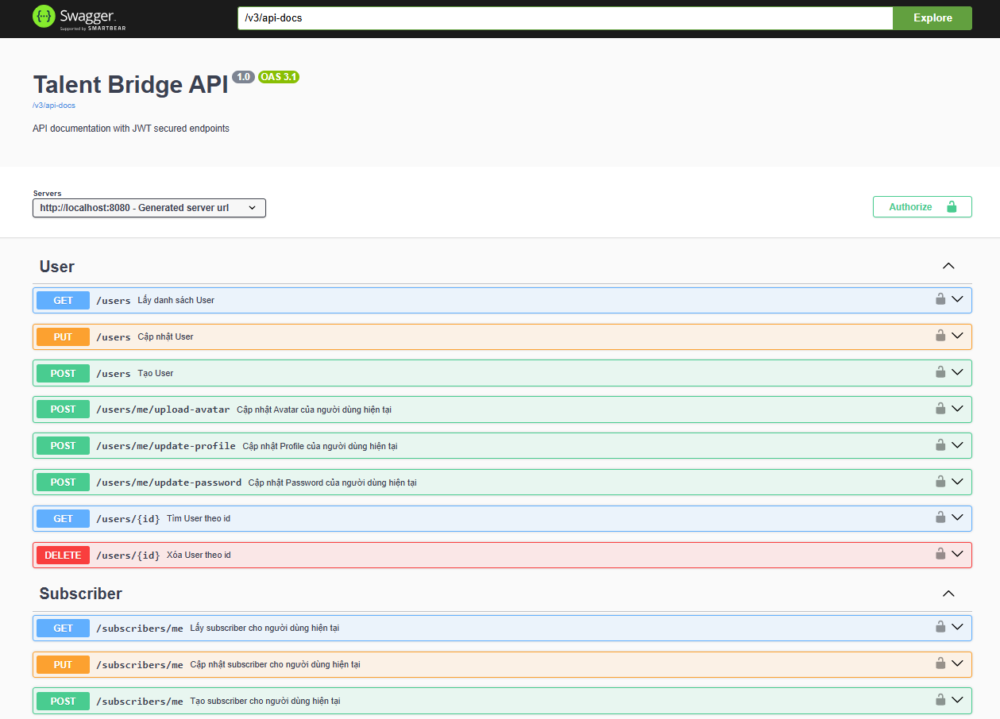

# TalentBridge

TalentBridge là nền tảng tuyển dụng thế hệ mới – nơi kết nối nhà tuyển dụng, ứng viên và admin trong một hệ sinh thái tiện lợi, minh bạch và bảo mật. Không chỉ đơn thuần là website tra cứu việc làm, TalentBridge còn giúp tối ưu hóa quy trình tuyển dụng, trải nghiệm người dùng và hiệu quả quản lý cho mọi bên.

<p align="center">
  
</p>

## 👥 3 nhóm người dùng – Mỗi vai trò, mỗi trải nghiệm

### 1. **USER (Ứng viên)**

- Tìm kiếm và khám phá chi tiết thông tin công ty, các vị trí tuyển dụng.
- Quản lý hồ sơ cá nhân toàn diện: cập nhật thông tin, đổi avatar, bảo mật tài khoản.
- Chủ động tạo, chỉnh sửa, xoá, tải lên CV – và có thể nộp/rút CV mọi lúc, mọi nơi.
- Đăng ký nhận email job alert siêu cá nhân hoá, tự động gợi ý công việc đúng ngành/nghề, kỹ năng mong muốn.

### 2. **RECRUITER (Nhà tuyển dụng)**

- Tự do đăng tin tuyển dụng, quản lý vị trí, chỉnh sửa hoặc ngừng tuyển bất kỳ lúc nào.
- Quản trị thông tin công ty: cập nhật profile, hình ảnh, nội dung giới thiệu.
- Quản lý & lọc ứng viên: duyệt CV, từ chối/nổi bật hồ sơ, xuất báo cáo hiệu quả.
- Mời thêm đồng nghiệp vào đội ngũ, phân quyền từng người theo chức năng tuyển dụng (quản lý tin đăng, duyệt hồ sơ…).

### 3. **ADMIN (Quản trị viên)**

- Quản lý toàn bộ hệ thống: duyệt, chỉnh sửa, khóa/xóa mọi loại tài khoản.
- Tạo, chỉnh sửa và phân quyền vai trò cực kỳ chi tiết cho từng tài khoản, nhóm người dùng.

---

## 🚩 Tổng quan công nghệ

TalentBridge kết hợp sức mạnh của **Spring Boot** và **React**

---

## 🛠️ Backend

- **Spring Boot**: Trái tim của hệ thống, hơn 60 endpoints “gánh” mọi nghiệp vụ backend.
- **Spring Security + Oauth2 Resource Server**: Xác thực, phân quyền “cứng” bằng JWT, an toàn tuyệt đối.
- **AWS S3**: Lưu trữ ảnh, file; chia folder public/private, presigned url bảo vệ file nhạy cảm (ví dụ: CV).
- **Redis + Spring Cache**: Quản lý refresh_token và link tạm thời, block link hết hạn, giữ dữ liệu luôn riêng tư.
- **Spring Mail + Thymeleaf**: Gửi email tự động, template đẹp, cá nhân hóa nội dung gửi đi.
- **Cronjob**: Gửi email gợi ý việc làm mỗi 8h sáng — luôn giữ kết nối với user.
- **Swagger**: Swagger được cấu hình sẵn trong dự án. Không cần cài thêm, chỉ cần chạy ứng dụng là có thể truy cập tài liệu API. (Khi App khởi động, Swagger sẽ hiện ở: http://localhost:8080/swagger-ui/index.html)

<p align="center">  </p>

---

## 💻 Frontend

- **React + Vite**: UI hiện đại, build siêu nhanh, DX mượt.
- **Redux Toolkit + Redux Persist**: State management “thép”, giữ app luôn nhất quán, tránh flash/reload mất trạng thái.
- **Axios interceptor**: Tự động refresh token, quên luôn cảnh báo token hết hạn.
- **Tailwind toàn tập**: Shadcn components, typography, line-clamp… cho giao diện bắt mắt, chuyên nghiệp, responsive chuẩn.
- **35+ layout/screens**: Đa dạng từ dashboard, bảng dữ liệu, profile cá nhân tới trang quản trị chi tiết.
- **React Quill + dompurify**: Editor WYSIWYG an toàn, chống XSS tối đa.
- **PDF Viewer**: Xem trực tiếp file PDF trên web, không cần tải về.
- **React Router v7**: Điều hướng đa trang, có route bảo vệ role-based.

---

## ⚙️ Cấu hình backend (`application.properties`)

> **Chạy file init_script.sql trong thư mục /project-init (Dùng HeidiSQL hoặc cái khác) để init data cơ bản**

- Tập tin SQL này chỉ tương thích và chạy được trên MySQL, MariaDB
- File sẽ thực hiện các tác vụ sau:
  - Khởi tạo Database Talent Bridge
  - Khởi tạo schema toàn bộ ứng dụng
  - Thêm nhiều dữ liệu vào bảng permissions
  - Thêm nhiều dữ liệu vào bảng roles (gồm 3 role: ADMIN, RECRUITER, USER)
  - Thêm 1 dữ liệu vào bảng user (email: admin@gmail.com, password: 123456, role: ADMIN)

> **Config các service Backend dùng tại `application.properties` với nội dung sau, tuỳ chỉnh các biến theo môi trường của bạn**

```properties
spring.application.name=TalentBridge-Backend

# Database connection config
spring.datasource.url=
spring.datasource.username=
spring.datasource.password=
spring.datasource.driver-class-name=
spring.jpa.hibernate.ddl-auto=update

# JWT Config
jwt.secret=
jwt.access-token-expiration=300
jwt.refresh-token-expiration=86400

# Pagination Config
spring.data.web.pageable.one-indexed-parameters=true
spring.data.web.pageable.max-page-size=20

# AWS S3
aws.access-key=
aws.secret-key=
aws.region=
aws.s3.bucket-name=

# Redis
redis.host=
redis.port=
redis.password=

# Caching
spring.cache.type=redis

# Swagger
springdoc.api-docs.path=/v3/api-docs

# Mail Sender
spring.mail.host=smtp.gmail.com
spring.mail.port=587
spring.mail.username=
mail.from=
spring.mail.password=
spring.mail.properties.mail.smtp.auth=true
spring.mail.properties.mail.smtp.starttls.enable=true
```

> **Config `S3 Service` trên AWS**

`Bucket policy`
Thay bucket-name bằng bucket của bạn

```
{
    "Version": "2012-10-17",
    "Statement": [
        {
            "Sid": "Statement1",
            "Effect": "Allow",
            "Principal": "*",
            "Action": "s3:GetObject",
            "Resource": "arn:aws:s3:::<bucket-name>/public/*"
        },
        {
            "Sid": "Statement2",
            "Effect": "Allow",
            "Principal": "*",
            "Action": "s3:GetObject",
            "Resource": "arn:aws:s3:::<bucket-name>/company-logos/*"
        },
        {
            "Sid": "Statement3",
            "Effect": "Allow",
            "Principal": "*",
            "Action": "s3:GetObject",
            "Resource": "arn:aws:s3:::<bucket-name>/avatar/*"
        }
    ]
}
```

`CROS Config`

```
[
    {
        "AllowedHeaders": [
            "*"
        ],
        "AllowedMethods": [
            "GET",
            "HEAD",
            "PUT",
            "POST",
            "DELETE"
        ],
        "AllowedOrigins": [
            "*"
        ],
        "ExposeHeaders": [
            "ETag",
            "Content-Length"
        ]
    }
]
```

`Block public access`

**Bỏ chọn** hai dòng sau:

- Block public access to buckets and objects granted through new public bucket or access point policies
- Block public and cross-account access to buckets and objects through any public bucket or access point policies

> ✔ Giữ nguyên hai dòng ACL được **check** để bảo mật tốt hơn (nếu không dùng ACL).

---
